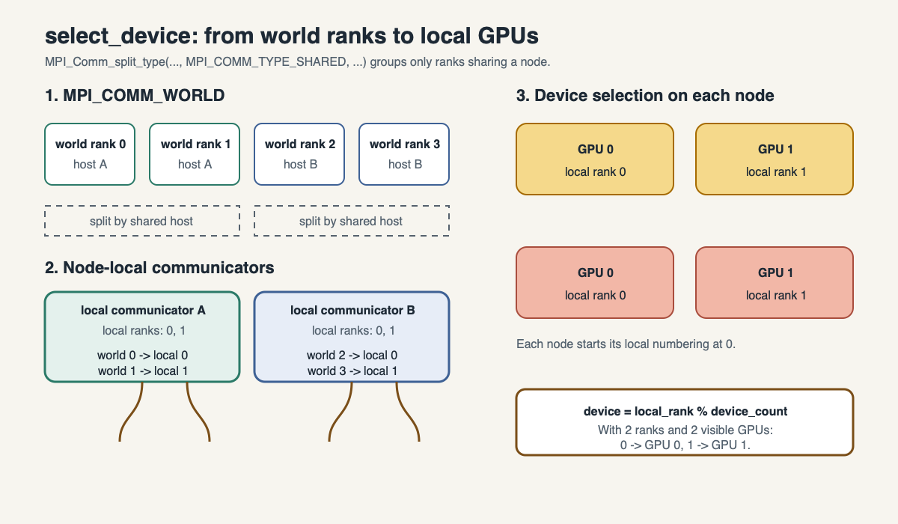
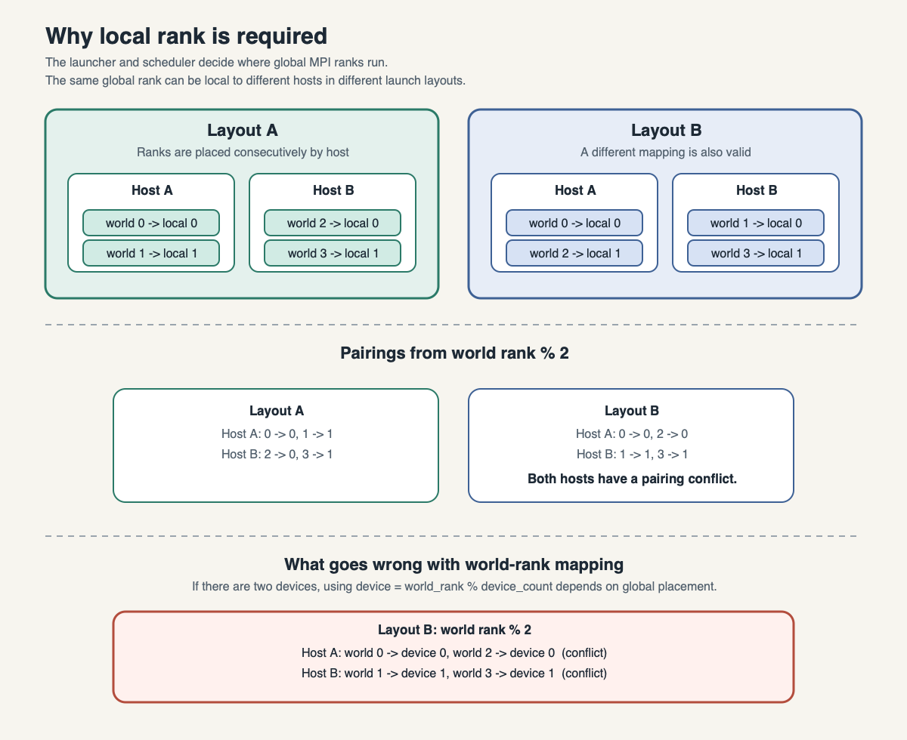

Setup and GPU placement
=======================

Prerequisites
-------------

Participants should know basic C/C++, CUDA kernels, and MPI point-to-point
calls. They need Gadi access, membership of the project ``vp91``.

Why combine MPI and CUDA?
-------------------------

CUDA accelerates computation within one node and MPI connects processes across
distributed-memory nodes. Combining them lets an application solve a problem
that is too large for one GPU, use several GPUs in parallel, or extend an
existing MPI application beyond one node. Each MPI process has a private
address space and is identified by a rank. Processes communicate through
point-to-point operations such as ``MPI_Send`` and ``MPI_Recv``; collective
operations such as ``MPI_Reduce`` combine values from several ranks.

The basic execution pattern is:

.. code-block:: c++

   MPI_Init(&argc, &argv);
   MPI_Comm_rank(MPI_COMM_WORLD, &rank);
   MPI_Comm_size(MPI_COMM_WORLD, &size);
   /* application work and MPI communication */
   MPI_Finalize();

The MPI compiler wrapper supplies the required headers and libraries, while
``mpirun`` or the PBS-launched equivalent starts one process for each rank.
This workshop uses MPI for distributed coordination and CUDA kernels for the
local grid computation.

Start in a clone on a filesystem visible to compute nodes, then submit:

.. code-block:: console

   $ qsub jobs-scripts/01-rank-device.pbs
   $ qstat -swx <job-id>
   $ less cuda-mpi-map.o<job-id>

The script requests two GPUs and two MPI ranks. ``01-rank-device.cu`` forms a
shared-memory communicator with ``MPI_Comm_split_type``. Its node-local rank
selects a CUDA device. Expected output maps local ranks 0 and 1 to different
GPUs on the same host. This follows the one-MPI-process-per-device pattern in
the :ref:`EPCC GPU course <ref-epcc-mpi-gpus>`, while using a node-local rank
rather than world rank so that the mapping remains valid across nodes.

How each MPI rank gets a different GPU
--------------------------------------

The example code is in [src/01-rank-device.cu](src/01-rank-device.cu), and the
matching launcher is [jobs-scripts/01-rank-device.pbs](jobs-scripts/01-rank-device.pbs).
The key idea is that a rank should not blindly use its global MPI rank as a
GPU number. Global rank 2 on a second node is not the same as GPU 2 on the
first node.

The following diagram shows how ``select_device`` creates a communicator for
each node and uses the resulting local rank to choose a GPU:

.. code-block:: c++

   // Each MPI rank must pick a different CUDA device on the same node.
   // The shared-memory communicator groups ranks that are on the same host,
   // so their local rank values are 0, 1, 2, ... in order. The mapping is:
   //   device = local_rank % device_count
   // With a 2-rank, 2-GPU job, rank 0 gets local rank 0 and rank 1 gets local
   // rank 1, so the first process uses GPU 0 and the second uses GPU 1.
   int device = select_device(MPI_COMM_WORLD, &local_rank);

The helper in [src/00-common.h](src/00-common.h) does the actual mapping:

.. code-block:: c++

   MPI_Comm local;
   MPI_CHECK(MPI_Comm_split_type(world, MPI_COMM_TYPE_SHARED, 0, MPI_INFO_NULL,
                                 &local));
   MPI_Comm_rank(local, &local_rank);
   cudaGetDeviceCount(&devices);
   int device = local_rank % devices;
   cudaSetDevice(device);

This is the important detail: ``MPI_COMM_TYPE_SHARED`` creates a communicator
that contains only the ranks on the same node. Those ranks are numbered from
``0`` upward as local ranks. The actual GPU choice is:

.. code-block:: c++

   device = local_rank % device_count

If there are two GPUs and two MPI ranks, the mapping is therefore ``0 -> GPU 0``
and ``1 -> GPU 1``. Across multiple nodes, ``MPI_COMM_WORLD`` rank numbers are
still unique, but the GPU number should always be chosen from the node-local
rank. This keeps one MPI process on each GPU without creating conflicts.

Why local rank matters
----------------------

The mapping between MPI ranks and node-local GPU devices depends on how
``mpirun`` is configured and how the batch system places processes. A world rank
of 2 does not necessarily mean "GPU 2"; it may be the first rank on a second
node, or it may be placed with other ranks on the same host depending on the
launch layout. Because of that, the code must be robust to different MPI launch
configurations rather than assuming that rank number and device number are the
same thing.

The two layouts below show why the node-local rank is needed. The scheduler and
``mpirun`` may distribute global ranks differently across hosts, but each host
still numbers the ranks in its shared-memory communicator from zero:

The helper in [src/00-common.h](src/00-common.h) therefore uses a node-local
rank obtained from ``MPI_COMM_TYPE_SHARED``. This makes the device selection
independent of the global MPI rank ordering and ensures that each process picks a
GPU consistent with its placement on the current node. The modulo fallback keeps
the code valid even when the number of ranks is not exactly matched to the
number of visible GPUs, but oversubscribing multiple ranks onto one GPU is
still normally undesirable. Prefer one rank per requested GPU whenever the job
layout allows it.

.. admonition:: Exercise (10 minutes)
   :class: exercise

   Change the script to request one GPU and run one rank. Predict and verify
   the local rank and device. Then explain why merely setting
   ``CUDA_VISIBLE_DEVICES`` globally is insufficient for several ranks.

PBS anatomy
-----------

The job script is a short description of the resources the batch system should
reserve for the run and the command line that should launch the MPI application.
The important directives are:

* ``-P vp91`` charges the job to project ``vp91``.
* ``-q gpuvolta`` selects the GPU queue.
* ``-l ncpus=24`` requests 24 CPU cores for the job.
* ``-l ngpus=2`` requests two GPUs; this matches the example's one-process-per-GPU pattern.
* ``-l mem=8gb`` sets the memory limit for the job.
* ``-l jobfs=1GB`` allocates local temporary disk space on the compute node.
* ``-l walltime=00:10:00`` sets the maximum wall-clock runtime before the job is terminated.
* ``-l storage=scratch/jxj900+gdata/vp91`` grants access to the requested project storage areas.
* ``-l wd`` starts the job in the directory from which the job was submitted.
* ``-N cuda-mpi-map`` gives the job a readable name in the scheduler output.

The final line uses Open MPI rank placement:

.. code-block:: console

   mpirun -np 2 --map-by ppr:2:node build/bin/01-rank-device

Here, ``ppr`` means ``processes per resource``. The value ``2`` says "place two
MPI ranks on each resource," and ``node`` says the resource is a node. In this
example, the job requests two ranks and two GPUs, so both ranks are placed on
one node and each rank can select a different local GPU. This is exactly the
layout we want for a node-local CUDA device selection pattern. If you instead
used ``ppr:1:node``, each rank would be placed on a separate node, which is a
very different distribution for multi-node jobs.

This explicit mapping is helpful because CUDA-aware MPI examples assume the rank
layout matches the GPU layout. For a single-node example, ``ppr:2:node`` keeps
both processes close to the available GPUs and makes the resulting device
assignment easy to reason about.
