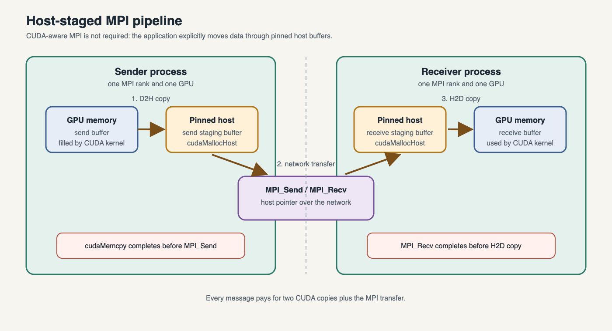

The host-staged baseline
========================

Ordinary MPI historically accepted host pointers only. A GPU application then
had to copy each outgoing buffer device→host, call MPI, and copy the received
buffer host→device. 

.. code-block:: text

   GPU send buffer -> pinned host buffer -> MPI -> pinned host buffer -> GPU

The full send and receive paths are shown below. The pinned buffers are ordinary
host memory from MPI's point of view; the application performs both CUDA copies
explicitly around the MPI operation.

Run the baseline:

.. code-block:: console

   $ qsub jobs-scripts/02-staged-pingpong.pbs

``02-staged-pingpong.cu`` uses ``cudaMallocHost`` because page-locked memory
supports faster and asynchronous CUDA copies. The blocking ``cudaMemcpy`` also
establishes the required ordering between the fill kernel and MPI.

.. note::

   ``malloc`` and ``cudaMallocHost`` both return host pointers, but they allocate
   different kinds of host memory. ``malloc`` returns ordinary pageable memory.
   CUDA can copy it, but the runtime may need to stage the data through a temporary
   pinned buffer, and asynchronous copies cannot use it reliably without additional
   care. ``cudaMallocHost`` returns page-locked (pinned) host memory, which the GPU
   can access directly for more predictable and asynchronous transfers. Both kinds
   of pointer are valid host buffers for ordinary MPI. Pinned memory is typically
   faster for repeated transfers, but it is a limited system resource and should be
   released with ``cudaFreeHost`` rather than ``free``.

The printed time contains the network transfer *and both CUDA copies*. This is
a pedagogical comparison, not a rigorous latency benchmark: add warm-ups,
many repetitions, barriers outside the timed region, and report a distribution
before drawing performance conclusions.

.. admonition:: Exercise (15 minutes)
   :class: exercise

   Change the element count to 1, 1 Ki, 1 Mi, and 16 Mi floats. Record time and
   explain why fixed overhead dominates small messages while bandwidth matters
   for large messages. Replace pinned allocation with ``malloc`` and compare.

Staging is still useful
-----------------------

It is portable to non-CUDA-aware MPI builds, can be easier to debug, and may
beat direct paths for some small messages or poorly configured networks. Treat
CUDA awareness as a capability to verify, not a universal speed guarantee.
Intel likewise describes a host-managed or "naïve" execution model as useful
for some small messages.