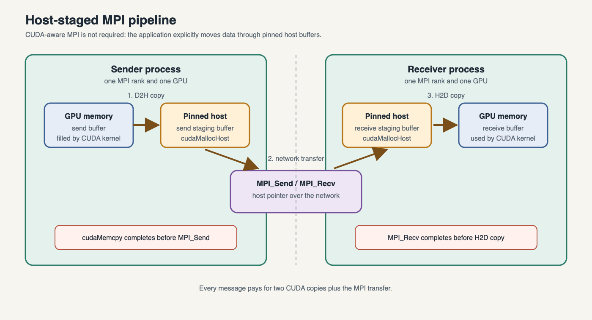

The host-staged baseline
========================

Ordinary MPI historically accepted host pointers only. A GPU application then
had to copy each outgoing buffer device→host, call MPI, and copy the received
buffer host→device. 

.. code-block:: text

   GPU send buffer -> pinned host buffer -> MPI -> pinned host buffer -> GPU

The full send and receive paths are shown below. The pinned buffers are ordinary
host memory from MPI's point of view; the application performs both CUDA copies
explicitly around the MPI operation.

Run the baseline:

.. code-block:: console

   $ qsub job-script/02-staged-pingpong.pbs

``02-staged-pingpong.cu`` uses ``cudaMallocHost`` because page-locked memory
supports faster and asynchronous CUDA copies. The blocking ``cudaMemcpy`` also
establishes the required ordering between the fill kernel and MPI.

.. note::

   ``malloc`` and ``cudaMallocHost`` both return host pointers, but they allocate
   different kinds of host memory. ``malloc`` returns ordinary pageable memory.
   Which means that the OS can generally page it out to swap when necessary.

   ``cudaMallocHost`` returns page-locked (pinned) host memory, 
   Here the OS is told that these pages must remain resident, so they cannot be 
   paged out to swap while pinned. 
    
   Pinned memory is typically faster for repeated transfers, but it can limit the memory OS 
   can work with.

The printed time contains the network transfer *and both CUDA copies*. This is
a pedagogical comparison, not a rigorous latency benchmark: add warm-ups,
many repetitions, barriers outside the timed region, and report a distribution
before drawing performance conclusions.

.. admonition:: Exercise (15 minutes)
   :class: exercise

   Change the element count to 1, 1 Ki, 1 Mi, and 16 Mi floats. Record time and
   explain why fixed overhead dominates small messages while bandwidth matters
   for large messages. Replace pinned allocation with ``malloc`` and compare.

Sample results
--------------

The following measurements correspond to the exercise's element counts in
order. Each float occupies 4 bytes. The timer includes the device-to-host
copy, MPI exchange, and host-to-device copy; initialization and the initial
MPI barrier are outside the timed region.

.. list-table:: Host-staged exchange measurements
   :header-rows: 1

   * - Float count
     - Data per rank
     - Printed MiB/rank
     - Time (ms)
     - Received sample
   * - 1
     - 4 bytes
     - 0.0
     - 0.047
     - 1
   * - 1 Ki (1,024)
     - 4 KiB
     - 0.0
     - 0.112
     - 1
   * - 1 Mi (1,048,576)
     - 4 MiB
     - 4.0
     - 6.276
     - 1
   * - 16 Mi (16,777,216)
     - 64 MiB
     - 64.0
     - 100.367
     - 1

The two smallest buffers print as ``0.0 MiB/rank`` because the size is rounded
to one decimal place. They still contain 4 bytes and 4 KiB respectively.

For small messages, the fixed costs of initiating CUDA copies and MPI
communication are significant compared with the cost of moving the data.
Increasing the payload from 4 bytes to 4 KiB multiplies its size by 1,024,
but the measured time increases by only about 2.4 times.

For larger messages, data movement becomes more important. Increasing the
payload from 4 MiB to 64 MiB multiplies its size by 16, and the measured time
also increases by approximately 16 times (6.276 ms to 100.367 ms). This is
consistent with bandwidth-dominated behaviour across the combined staging
copies and MPI exchange; it does not measure network bandwidth alone.

.. note::

   These are individual measurements, not performance guarantees. 
   Ideally you should have a warm-up run before any measurements.

