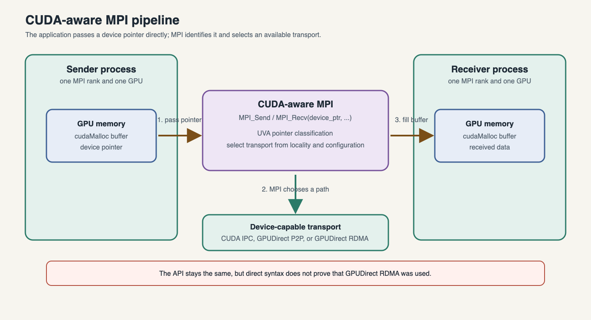

Direct device-buffer MPI
========================

A CUDA-aware MPI library recognises the address returned by ``cudaMalloc`` and
selects a device-capable transport or performs internal staging. Application
code passes that pointer directly, without changing the MPI API:

.. code-block:: c++

   cudaDeviceSynchronize();
   MPI_Sendrecv_replace(device, count, MPI_FLOAT, peer, 0,
                        peer, 0, MPI_COMM_WORLD, MPI_STATUS_IGNORE);

The data path is summarized below. The application passes the ``cudaMalloc``
pointer directly to MPI; CUDA-aware MPI classifies the pointer through Unified
Virtual Addressing and chooses a device-capable path when one is available.
It may instead manage an internal pinned-host fallback, so the call syntax alone
does not prove that GPUDirect RDMA was used.

Run ``qsub jobs-scripts/03-device-pingpong.pbs`` and compare its output with
the staged run. Direct syntax does not prove GPUDirect RDMA occurred; the MPI
implementation may choose CUDA IPC, GPUDirect RDMA, or an internal bounce
buffer according to locality, size, hardware, and configuration.

How MPI finds device memory
---------------------------

CUDA Unified Virtual Addressing (UVA) places host memory and the memory of the
GPUs on a node in one virtual address space. CUDA-aware MPI can inspect the
pointer address and determine whether a buffer is on the host or on a device,
without changing the MPI API or adding a separate device-buffer argument. UVA
is an address-identification mechanism; it does not guarantee a particular
transport or that a transfer will avoid host memory. The UVA-based pointer
classification model is described in the :ref:`NVIDIA introduction
<ref-nvidia-cuda-aware>`.

GPUDirect communication paths
-----------------------------

The MPI library selects a path based on GPU and network locality, message
size, hardware, and configuration:

* **GPUDirect P2P** can move data directly between GPUs on the same node.
* **GPUDirect RDMA** can let a network adapter read or write GPU memory for an
   inter-node transfer without a host-memory staging copy.
* **GPUDirect accelerated communication** can remove an extra copy between a
   CUDA driver buffer and a network-fabric buffer.

When these paths are unavailable, CUDA-aware MPI can still accept the device
pointer and perform internal staging through pinned host buffers. For larger
messages, implementations may divide the transfer into chunks and pipeline
PCIe transfers, host copies, and network operations. Therefore, passing a
device pointer is not by itself proof that GPUDirect RDMA was used. See the
:ref:`NVIDIA introduction <ref-nvidia-cuda-aware>` for diagrams of direct,
accelerated, internally staged, and application-staged paths.

Asynchronous fallback staging
-----------------------------

With a non-CUDA-aware MPI implementation, an application can reduce staging
overhead by using pinned host buffers, CUDA streams, and asynchronous
``cudaMemcpyAsync`` operations. It must still coordinate the stream and MPI
operations carefully: do not send a host buffer until the device-to-host copy
has completed, and do not use the received device buffer until the host-to-
device copy has completed. CUDA-aware MPI can automate more of this protocol
and choose the available transport internally.

Ordering and ownership
----------------------

MPI generally does not understand arbitrary CUDA stream dependencies. Complete
a producer kernel before MPI reads its buffer. After a blocking receive or a
completed nonblocking request, a kernel may consume the buffer. Never modify a
send buffer or read a receive buffer while its nonblocking request is active.

Capability checks
-----------------

Inspect the loaded implementation and its build-time CUDA support:

.. code-block:: console

   $ module list
   $ ompi_info --parsable -l 9 | grep -i cuda

The exact output is version-dependent. A crash such as ``invalid buffer
pointer`` when the staged example works strongly suggests that the loaded MPI
or selected transport cannot handle device memory. Confirm against the current
NCI software page rather than forcing undocumented MCA parameters.

A CUDA-aware MPI build is necessary but not sufficient: the hardware, PCIe or
NVLink topology, network fabric, and runtime transport selection must also
support the direct path. Check each layer separately:

* ``nvidia-smi topo -m`` shows whether GPU pairs are connected by PCIe or NVLink
  and is the first check for **GPUDirect P2P**.
* ``cudaDeviceCanAccessPeer`` can confirm at runtime that two GPUs can exchange
  data directly.
* ``ibstat`` or ``ibv_devinfo`` confirms whether the node has an RDMA-capable
  network interface, which is required for **GPUDirect RDMA**.
* ``ucx_info -d`` or the Open MPI transport configuration shows whether the
  active transport supports GPU buffers, such as ``cuda_copy`` or CUDA-aware
  RDMA paths.

These checks help distinguish the three common cases:

* **GPUDirect P2P**: direct movement between GPUs on the same node.
* **GPUDirect RDMA**: NIC reads or writes GPU memory for inter-node transfers
  without a host staging copy.
* **GPUDirect accelerated communication**: a CUDA-aware path removes an extra
  buffer copy between a CUDA driver buffer and a network-fabric buffer.

The MPI library may still choose an internal staging path if the direct path is
not available, so capability checks should be treated as a reliability and
performance check rather than a guarantee that a particular transport will be
used in every run.

Beyond simple buffers
---------------------

Contiguous point-to-point messages are the safest starting point. CUDA-aware
support for collectives, one-sided MPI, device-resident derived datatypes,
managed memory, and noncontiguous layouts varies by MPI version and transport.
Pack strided halos with a CUDA kernel into a contiguous buffer when portability
or performance is uncertain. The MPI datatype describes layout; it does not by
itself make the MPI implementation GPU-aware.

.. admonition:: Exercise (15 minutes)
   :class: exercise

   Remove ``cudaDeviceSynchronize`` after the fill kernel. Identify the race,
   even if a particular run appears correct. Restore it, then run ranks on one
   node and on two nodes and identify the distinct transport paths.
