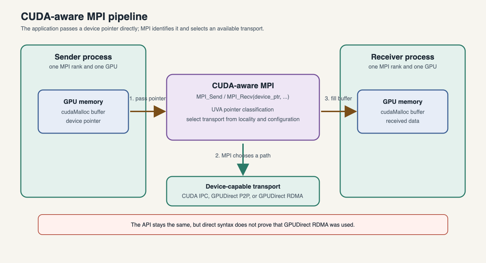

Direct device-buffer MPI
========================

A CUDA-aware MPI library recognises the address returned by ``cudaMalloc`` and
selects a device-capable transport or performs internal staging. Application
code passes that pointer directly, without changing the MPI API:

.. code-block:: c++

   MPI_Sendrecv_replace(
      h,                  /* pinned host buffer: send its contents, then replace with received data */
      (int)n,             /* number of elements to send and space for received elements */
      MPI_FLOAT,          /* datatype of each buffer element */
      1 - rank,           /* destination: the other rank (0 sends to 1, 1 sends to 0) */
      0,                  /* send tag identifying the outgoing message */
      1 - rank,           /* source: receive from the other rank */
      0,                  /* receive tag matching the incoming message */
      MPI_COMM_WORLD,     /* communicator containing both ranks */
      MPI_STATUS_IGNORE   /* discard receive status, such as sender and message tag */
   );

The data path is summarized below. The application passes the ``cudaMalloc``
pointer directly to MPI; CUDA-aware MPI classifies the pointer through Unified
Virtual Addressing and chooses a device-capable path when one is available.

.. note::

   Unified Virtual Address Space: A single virtual address space is used for all host memory and all global memory on all GPUs in 
   the system within a single OS process. All memory allocations on the host and on all devices lie in this virtual address space. 
   
   This is true whether allocations are made with CUDA APIs ( cudaMalloc, cudaMallocHost) or with system allocation APIs 
   (new, malloc). The CPU and each GPU has a unique range within the unified virtual address space.

Run ``qsub job-script/03-device-pingpong.pbs`` and compare its output with
the staged run. Direct syntax does not prove GPUDirect RDMA occurred; the MPI
implementation may choose CUDA IPC, GPUDirect RDMA, or an internal bounce
buffer according to locality, size, hardware, and configuration.

Sample results
--------------

The following device-buffer measurements use the same element-count order as
the exercise in :doc:`02-staging`: 1, 1 Ki, 1 Mi, and 16 Mi floats. The staged
measurements from that chapter are included for comparison. Each float occupies
4 bytes; the two smallest sizes print as ``0.0 MiB/rank`` because the program
prints only one decimal place.

.. list-table:: Single-exchange timings
   :header-rows: 1

   * - Float count
     - Data per rank
     - Device-buffer time (ms)
     - Staged time (ms)
     - Received sample
   * - 1
     - 4 bytes
     - 1.058
     - 0.047
     - 1
   * - 1 Ki (1,024)
     - 4 KiB
     - 1.185
     - 0.112
     - 1
   * - 1 Mi (1,048,576)
     - 4 MiB
     - 9.978
     - 6.276
     - 1
   * - 16 Mi (16,777,216)
     - 64 MiB
     - 113.863
     - 100.367
     - 1

The device-buffer version may be slower in these measurements. Passing a
GPU pointer does not guarantee a faster
transfer. 

Several effects could contribute to the difference:

* **First-use overhead:** each program times only one exchange. The first
  device-buffer operation may include GPU-memory registration, establishing
  interprocess GPU access, or other transport setup. Fixed costs matter most
  when the payload is tiny.
* **Internal staging:** MPI may copy through host buffers internally. In that
  case, passing a device pointer does not remove staging and can add buffer
  management overhead compared with explicit pinned-host staging.
* **Buffer replacement:** both examples use ``MPI_Sendrecv_replace``. MPI must
  preserve outgoing values while receiving into the same buffer, which can
  require temporary storage or extra copying. Its cost can differ between
  host and device buffers.

.. note::

   These are possible explanations, not diagnoses established by the timings.
   The logs would need to identify the selected transport and protocol to explain
   the actual path.

   For a more reliable comparison, use the same modules, rank/GPU placement, and
   message sizes; perform untimed warm-up exchanges on the same allocations; then
   time many exchanges and report time per exchange over repeated runs. Keep both
   CUDA staging copies inside every timed staged iteration. Disable verbose
   transport logging for timing runs. A comparison with separate send and receive
   buffers can also help isolate the cost of buffer replacement.

Results after two warm-up exchanges
~~~~~~~~~~~~~~~~~~~~~~~~~~~~~~~~~~

The ``13-warmup-run`` example compares both methods in the same program. Each
method performs two untimed warm-up exchanges followed by one timed exchange.

.. code-block:: text

   staged: 1048576 floats, 4.000000 MiB/rank, 2 warm-ups, 1 timed exchange, 2.441 ms, received 1, validation PASS
   device-direct: 1048576 floats, 4.000000 MiB/rank, 2 warm-ups, 1 timed exchange, 2.425 ms, received 1, validation PASS

.. list-table:: Warmed-up transfer comparison
   :header-rows: 1

   * - Method
     - Time (ms)
     - Validation
   * - Host-staged
     - 2.441
     - PASS
   * - Device-buffer
     - 2.425
     - PASS

How MPI finds device memory
---------------------------

CUDA Unified Virtual Addressing (UVA) places host memory and the memory of the
GPUs on a node in one virtual address space. CUDA-aware MPI can inspect the
pointer address and determine whether a buffer is on the host or on a device,
without changing the MPI API or adding a separate device-buffer argument. UVA
is an address-identification mechanism; it does not guarantee a particular
transport or that a transfer will avoid host memory. 

.. note:: 

   Staging is still useful: It is portable to non-CUDA-aware MPI builds, can be easier to debug, and may
   beat direct paths for some small messages or poorly configured networks. Treat
   CUDA awareness as a capability to verify, not a universal speed guarantee.

Asynchronous fallback staging
-----------------------------

With a non-CUDA-aware MPI implementation, an application can reduce staging
overhead by using pinned host buffers, CUDA streams, and asynchronous
``cudaMemcpyAsync`` operations. It must still coordinate the stream and MPI
operations carefully: do not send a host buffer until the device-to-host copy
has completed, and do not use the received device buffer until the host-to-
device copy has completed. CUDA-aware MPI can automate more of this protocol
and choose the available transport internally.

Ordering and ownership
----------------------

MPI generally does not understand arbitrary CUDA stream dependencies. Complete
a producer kernel before MPI reads its buffer. After a blocking receive or a
completed nonblocking request, a kernel may consume the buffer. Never modify a
send buffer or read a receive buffer while its nonblocking request is active.

Capability checks
-----------------

Inspect the loaded implementation and its build-time CUDA support:

.. code-block:: console

   $ module load openmpi/4.1.5
   $ ompi_info --parsable -l 9 | grep -i cuda

+--------------------------------------+--------------------------------------------------+
| Output                               | Meaning                                          |
+======================================+==================================================+
| ``--with-cuda=/apps/cuda/12.0.0``    | Open MPI was configured with CUDA 12.0.           |
+--------------------------------------+--------------------------------------------------+
| ``options:mpi_ext:...cuda...``       | CUDA-related MPI extensions are enabled.         |
+--------------------------------------+--------------------------------------------------+
| ``mca:btl:smcuda``                   | CUDA-aware shared-memory transport component.    |
+--------------------------------------+--------------------------------------------------+
| ``mca:coll:cuda``                    | CUDA-related collective communication component. |
+--------------------------------------+--------------------------------------------------+
| ``component:4.1.5``                  | Component version is Open MPI 4.1.5.              |
+--------------------------------------+--------------------------------------------------+

The exact output is version-dependent. 

A CUDA-aware MPI build is necessary but not sufficient: the hardware, PCIe or
NVLink topology, network fabric, and runtime transport selection must also
support the direct path. Check each layer separately:

* ``nvidia-smi topo -m`` shows whether GPU pairs are connected by PCIe or NVLink
  and is the first check for **GPUDirect P2P**.
* ``cudaDeviceCanAccessPeer`` can confirm at runtime that two GPUs can exchange
  data directly.

These checks help distinguish the three common cases:

* **GPUDirect P2P**: direct movement between GPUs on the same node.
* **GPUDirect RDMA**: NIC reads or writes GPU memory for inter-node transfers
  without a host staging copy.
* **GPUDirect accelerated communication**: a CUDA-aware path removes an extra
  buffer copy between a CUDA driver buffer and a network-fabric buffer.

The MPI library may still choose an internal staging path if the direct path is
not available, so capability checks should be treated as a reliability and
performance check rather than a guarantee that a particular transport will be
used in every run.

Beyond simple buffers
---------------------

Contiguous point-to-point messages are the safest starting point. CUDA-aware
support for collectives, one-sided MPI, device-resident derived datatypes,
managed memory, and noncontiguous layouts varies by MPI version and transport.
Pack strided halos with a CUDA kernel into a contiguous buffer when portability
or performance is uncertain. The MPI datatype describes layout; it does not by
itself make the MPI implementation GPU-aware.

.. admonition:: Exercise (15 minutes)
   :class: exercise

   Remove ``cudaDeviceSynchronize`` after the fill kernel. Identify the race,
   even if a particular run appears correct. Restore it, then run ranks on one
   node and on two nodes and identify the distinct transport paths.
