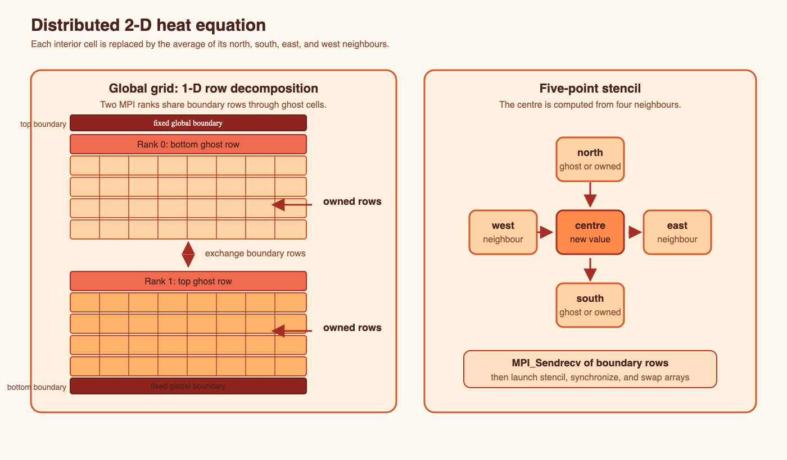

Application: blocking Jacobi
============================

We solve a steady 2-D heat equation using a five-point stencil. Each iteration
replaces an interior cell by the average of its four neighbours. A 1-D row
decomposition gives every rank owned rows plus top and bottom ghost rows.

The grid decomposition and five-point update are shown together below. Orange
rows are owned by a rank, red rows are ghost or fixed boundary rows, and the
centre cell is updated from its four neighbours.

.. note::

   Ghost boundaries are extra rows stored by a rank but owned by a neighbouring
   rank. They hold the neighbouring rank's boundary values so the local stencil
   can read its north and south neighbours without accessing another rank's
   memory. At each iteration, neighbouring ranks exchange their outer owned rows
   to refresh the ghost rows. A physical edge of the global grid has no neighbour;
   ``MPI_PROC_NULL`` leaves that exchange harmless while the fixed boundary value
   remains unchanged.

.. note::

   Fixed global boundaries are the physical edges of the whole heat domain,
   such as a wall held at a prescribed temperature. Their values are set by the
   problem and remain unchanged during Jacobi iterations; they are not owned
   boundary rows exchanged between ranks. A rank next to a global edge uses the
   fixed value when updating its adjacent interior cells. ``MPI_PROC_NULL``
   represents the missing neighbour at that edge, so no message is sent or
   received there.

.. code-block:: text

   rank r-1:       [last owned row]
                              | exchange
   rank r:   [top ghost][owned rows ...][bottom ghost]
                                              | exchange
   rank r+1:                         [first owned row]

``04-jacobi-blocking.cu`` sends boundary rows directly from GPU memory with two
``MPI_Sendrecv`` calls, launches the stencil, synchronises, and swaps the old
and new arrays. ``MPI_PROC_NULL`` handles global domain edges without branches
around MPI calls.

.. code-block:: console

   $ qsub jobs-scripts/04-jacobi-blocking.pbs

The standard job uses two ranks and two GPUs on one node. Arguments are
``nx ny iterations`` and ``ny`` must divide by the rank count. Timing uses the
maximum rank duration because the slowest rank determines application time.
For an inter-node experiment, adapt the flat resource requests to reserve two
complete GPU nodes and change placement to ``--map-by ppr:1:node``. Gadi's
scheduler allocates GPUs as node resources, so a guaranteed two-host run
requires two GPU nodes. Confirm the current node size and queue policy first.

Correctness checklist
---------------------

Check all CUDA/MPI return codes, avoid exchanging the ghost rows as owned data,
match tags and neighbours, preserve fixed global boundaries, and compare the
reported sample sum between blocking and overlap versions. A sample is a smoke
test, not a proof; production verification should compute a global norm or
compare with a CPU reference on a small grid.

.. admonition:: Exercise (20 minutes)
   :class: exercise

   Draw rank 0 and rank 1's allocation and label the pointer used by every send
   and receive. Change to ``2048 2048 100``. Use the output to calculate cell
   updates per second: ``nx * ny * iterations / seconds``.
