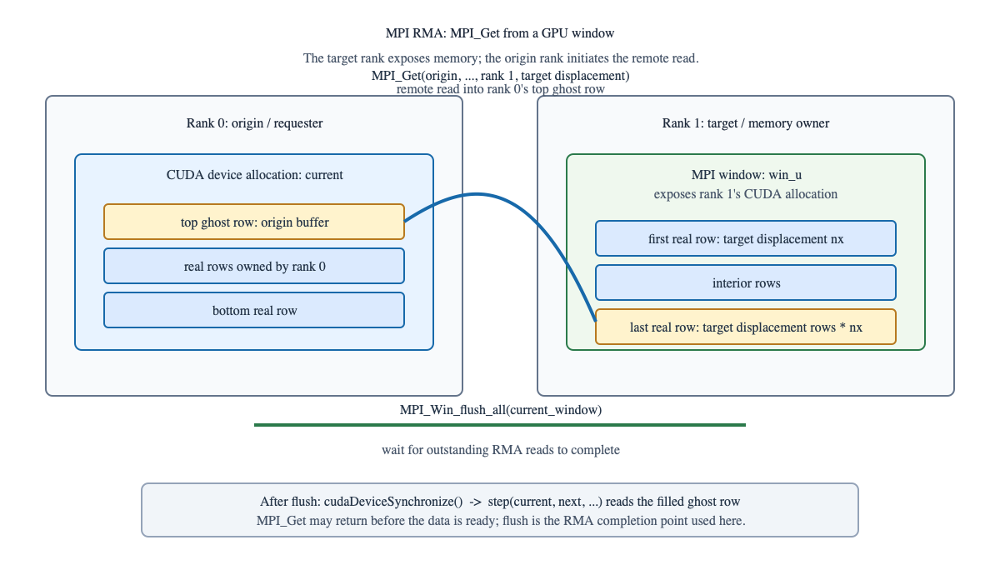

MPI one-sided / RMA with GPU buffers
===================================

This chapter covers the use of MPI one-sided communication, also called Remote
Memory Access (RMA), with CUDA device buffers. It complements the point-to-point
and collective examples in the rest of the repository by highlighting a pattern
that is commonly used for irregular updates, distributed data structures, and
“put/get” synchronization models that differ from the explicit send/receive halo
exchange in the Jacobi examples.

The main idea is simple: one rank exposes a region of memory, and another rank
reads or writes to it without an explicit matching receive on the remote side.
When the memory is in GPU-resident storage, the MPI implementation must decide
whether to use a direct GPU memory path or an intermediate host staging path.
The exact behavior depends on the MPI library, the transport stack, the memory
registration model, and the hardware topology.

Do not assume that passing a device pointer to an MPI RMA call guarantees a
GPU-direct path. The implementation may still use host staging or another
internal transfer strategy. The only safe statement is: the MPI library accepts
that pointer and may select a direct transport where supported.

Why RMA is different from point-to-point
----------------------------------------

The Jacobi examples use a classic two-sided ``MPI_Sendrecv`` exchange: each
rank sends data to a partner and receives data back in a matching receive call.
The communication pattern is symmetric and explicitly synchronized by sends and
receives.

MPI RMA is different. One side defines a window and exposes a memory region.
Another rank then executes a ``Put`` or ``Get`` operation against that window.
The call is still ordered by the MPI semantics, but the communication pattern is
not a matched send-receive exchange in the same way.

This matters for GPU work because a local rank may update a remote GPU buffer
without first staging the data through host memory, depending on the
implementation and configuration.

A conceptual model
------------------

A simple RMA model looks like this:

.. code-block:: text

   rank 0                         rank 1
   ------                        ------
   create window on GPU data      create window on GPU data
   MPI_Win_lock                   MPI_Win_lock
   MPI_Put(..., remote_gpu_ptr)   MPI_Get(..., remote_gpu_ptr)
   MPI_Win_unlock                 MPI_Win_unlock

The communication is still explicit in the API, but it is not organized around
matching send/receive tags in the same way as the halo exchange examples.
The application decides which process owns which region of data and when to
synchronize access.

The following diagram shows the ``MPI_Get`` direction. Rank 0 is the origin of
the operation and receives a row into its device ghost buffer. Rank 1 is the
target and exposes its device allocation through ``win_u``. The flush is the
completion point before the CUDA stencil consumes the received row.

The arrow points from the origin buffer to the remotely exposed target row:
``MPI_Get`` reads remote memory into the caller's local buffer. This is the
opposite data direction from ``MPI_Put``, which writes the caller's data into
the target window.

This is useful for updates such as:

- distributed sparse matrices
- irregular stencil updates
- shared data structures across ranks
- asynchronous updates where one rank owns the data but another rank updates it

MPI RMA and CUDA device memory
-----------------------------

The first practical question is whether the window is device memory or host
memory.

For a GPU buffer:

* The pointer must be a valid allocation in the process address space.
* The MPI library must support CUDA-aware RMA for that transport.
* The memory may be registered for direct access internally.
* The implementation may still select staging if the transport or backend
  does not support a direct path.

In other words, a device pointer is necessary for GPU memory, but not sufficient
for a guarantee that the MPI library will use a zero-copy or GPUDirect-like path.

This is a key lesson repeated throughout the repository: a CUDA-aware MPI call
accepts device memory, but the actual transport depends on the implementation
stack.

Typical one-sided operations
---------------------------

The main operations are:

* ``MPI_Put``: write data from the calling process into the target window
* ``MPI_Get``: read data from the target window into the calling process
* ``MPI_Accumulate``: update remote data using a reduction-like operation
* ``MPI_Win_lock`` / ``MPI_Win_unlock``: acquire/release access to a window
* ``MPI_Win_fence``: synchronize access across the window for some cases

The one-sided API is designed around window exposure and synchronization, not
around explicit send and receive tags.

For GPU workloads, this is often used when:

* the ownership pattern is naturally asymmetric
* updates are sparse or irregular
* the application wants to avoid a dedicated receive side
* one rank needs to write into data owned by another rank

Correctness and synchronization
------------------------------

RMA is easy to misuse. The main hazard is synchronization.

The following are essential:

* lock the target window before access
* ensure the source and target memory are valid and synchronized
* respect the MPI memory model and the target's synchronization epoch
* use fences or locks consistently between local and remote operations
* avoid reading stale data after a remote write is still in flight

For CUDA codes, this also means the application must keep CUDA stream ordering
and MPI visibility consistent. A remote write from a different rank may not be
visible to the target process until the corresponding synchronization is
completed, and device-side writes may need explicit synchronization depending on
how the memory is used.

This is a common place where a program looks correct but still fails because the
GPU write is not synchronized with the MPI visibility boundary.

Portability and performance warnings
------------------------------------

MPI RMA with GPU buffers is attractive, but portability is not automatic.

The following questions matter in real applications:

* Is the MPI implementation CUDA-aware for this specific RMA operation?
* Are the GPU buffers registered with the backend?
* Does the transport use GPUDirect, staging, or a fallback path?
* Does the system provide enough MPI progress for asynchronous traffic?
* Are the devices connected with NVLink or PCIe, and does that affect locality?

Memory registration, user buffers, and backend configuration may also affect
whether GPU RMA is efficient. In practice, the same code can perform very
differently on different clusters or MPI builds.

A useful mental model is:

.. note::

   Device buffers are often legal inputs to MPI RMA, but a direct transport is
   not guaranteed. The MPI stack chooses a path based on the environment, the
   backend, and the memory registration model.

When to use RMA versus point-to-point
-------------------------------------

Use point-to-point communication when:

* the communication pattern is naturally paired and symmetric
* you already have ghost rows or halo exchange logic
* send/receive tags are simple and clear

Use RMA when:

* ownership is asymmetric
* updates are sparse or irregular
* one rank writes into remote data more naturally than matching a receive
* the application can tolerate more complex synchronization rules

In many CUDA-aware stencil codes, point-to-point halo exchange remains simpler
and more transparent. RMA becomes valuable when the algorithm benefits from more
flexible ownership and update patterns.

Checklist for a GPU RMA example
-------------------------------

A correct GPU RMA exercise should check the following:

* the remote window is allocated in device memory
* the window is created with the correct communicator and target rank
* the source and target memory are synchronized before and after the operation
* the communication is wrapped in the correct lock or fence epoch
* the target reads the updated value only after the synchronization point
* the backend is known to support the chosen path, or the fallback is documented
* the program reports whether the data path is direct or staged

This is the same caution that appears throughout the repository: a successful
CUDA-aware MPI call does not prove a particular network or device transport.

Further reading
---------------

The core repository examples already cover the following patterns:

* point-to-point halo exchange in the Jacobi examples
* direct device communication and buffer ownership
* GPUDirect transport and topology concerns
* debugging and performance interpretation

For a full GPU RMA discussion, extend the code with a small distributed array or
shared sparse pattern, then compare the one-sided approach to the explicit halo
exchange used in the Jacobi solvers. That comparison is often the clearest way
to see when RMA is a good fit and when a matched send/receive pattern is
stricter and simpler.
